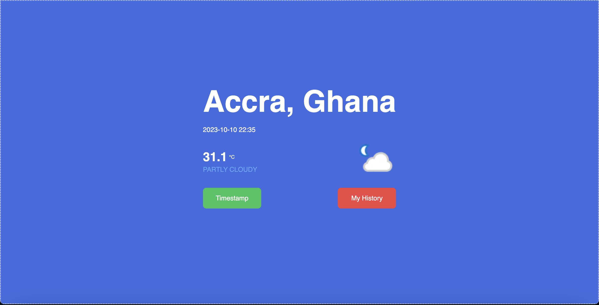

# Weather App v2.0


This is a application that allows you to view weather information about your current location. 

## Table of contents

- [Overview](#overview)
  - [The challenge](#the-challenge)
  - [Screenshot](#screenshot)
  - [Links](#links)
- [My process](#my-process)
  - [Built with](#built-with)
  - [What I learned](#what-i-learned)
  - [Continued development](#continued-development)
  - [Useful resources](#useful-resources)
- [Author](#author)
- [Acknowledgments](#acknowledgments)
- [API(s) used](#apis-used)

## Overview
An application that takes uses gives weather information based on your location data.
### The challenge

Users should be able to:

- See current weather trends in their location and timestamp the data for future reference.
- Select a location to view weather trends in that location as well
- See hover and focus states for all interactive elements on the page


### Screenshot



### Links

- Solution URL: [Github Link (currently private)](https://github.com/Asiedu13/weather-app)
- Live Site URL: [Weather App](https://weather-app-asiedu13.vercel.app/)

## My process
### Selecting the Tools / Technologies
I decided to use Next.js because I wanted to learn Next.js and try out all the extra features Next.js gives to a React application.
At this stage, I researched various APIs for finding a client and getting meteorological data for the user.

### Planning the Layouts
I then took the time to consider the various views and UI components that would be needed for the application.

### Building the Views 
I then wrote code for everything planned and still planning
### Built with

- Next.js
- Tailwindcss
- Flexbox
- fontawesome
- Mobile-first workflow
- Weather API on RapidAPI platform
- GeolocationAPI

## What I learned

This project helped me learn about the various features of Next. From file based routing to all the optimizations Next undertakes to keep the application fast at all levels.

This project also allowed me to
- learn about caching techniques such as local storage
- working with APIs to achieve a goal
- implement tailwindcss in a Next app


```html
 <section className="w-[fit-content] h-1/2">
              <section className='py-4'>
                <h1 className='text-7xl font-bold pb-5 '> {city}, {country_code}</h1>
                <p> {today}</p>
                </section>
 <section />
```


## Continued development
Further on in this project, I would like to
- Access to location data of different locations
- Keep a list favourite locations
- Provide more information on the weather of a location
- Important world events that ocurred with specific weather conditions

## Useful resources

- [Tailwind official docs](https://tailwindcss.com/docs/installation) - This helped me with using tailwindcss for the project. I really liked the simplicity and the ctrl + K shortcut for searching.
- [Weather API](https://rapidapi.com/weatherapi/api/weatherapi-com) - This is an amazing API for finding current and historical data on the weather of a location. I'd recommend this to anyone that would want such data.
- [VERCEL DEPLOYMENT Intricacies](https://vercel.com/docs/projects/environment-variables/system-environment-variables) - This article talks about the configurations required for certain features such as env files with vercel

- [React Suspense Fetch Patterns ](https://blog.logrocket.com/data-fetching-react-suspense/)


**However, I am open to alternatives so reach out to me if you have any.**


## Author

- Website - [Asiedu Prince Kofi](Asiedu13.github.io)
- Github - [@Asiedu13](https://github.com/Asiedu13)
- Twitter - [@Prince_KAsiedu](https://www.twitter.com/Prince_KAsiedu)
- LinkedIn - [@Prince Asiedu](https://www.linkedin.com/in/princek-asiedu/)


## Acknowledgments

https://stackabuse.com/guide-to-getting-started-with-nextjs-create-a-nextjs-app/

https://vercel.com/guides/how-to-add-vercel-environment-variables

### API(s) Used
[RapidAPI Weather API](https://rapidapi.com/weatherapi/api/weatherapi-com)
